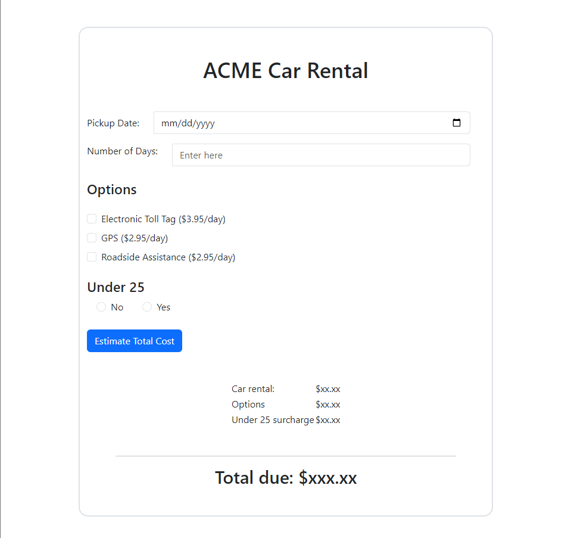
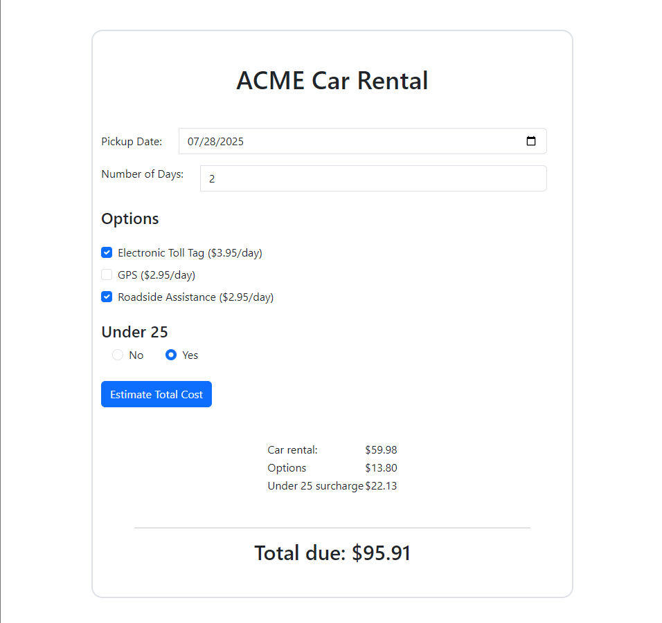
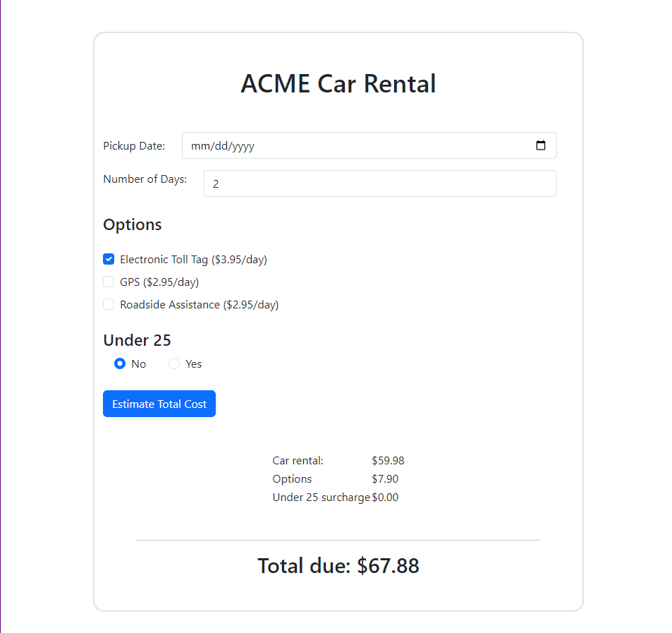

# Car Rental Project

This project is a simple web application for estimating the total cost of renting a car based on the number of days, selected options, and whether the renter is under 25 years old. It provides a straightforward interface for users to input their preferences and receive an estimated total cost.

## Usage

To use this application, simply open the `index.html` file in a web browser. Then, input the pickup date, number of days for rental, select any desired options (such as toll tag, GPS, or roadside assistance), and indicate whether the renter is under 25. After filling in these details, click the "Estimate Total Cost" button to see the calculated total.

## Technologies Used

- **HTML:** The structure of the web page is defined using HTML markup.
- **Bootstrap 5:** Bootstrap CSS is used for styling the web page, providing a clean and responsive design.
- **JavaScript:** The functionality of the application, including calculating the total cost based on user inputs, is implemented using JavaScript.

## Features

- Input fields for pickup date and number of days.
- Checkboxes for selecting optional add-on items such as toll tag, GPS, and roadside assistance.
- Radio buttons to indicate whether the renter is under 25.
- Upon clicking the "Estimate Total Cost" button, the application calculates and displays the total cost, including the rental amount, selected options, and any applicable surcharge.

## File Structure
- **screenshots** Contains images of the project with different situations.

- **index.html:** Contains the HTML markup for the web page, including input fields, checkboxes, and buttons.

- **scripts/index.js:** JavaScript file containing the logic for calculating the total cost based on user inputs and updating the displayed amounts.

## Images

- 

- 

- 