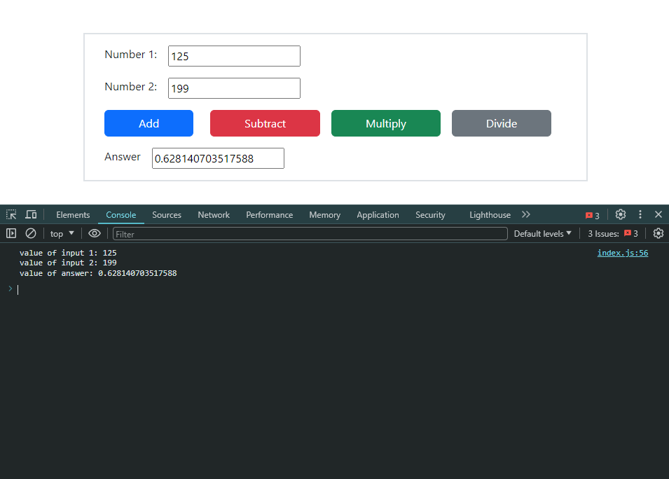

# Basic Calculator

This is a simple calculator web application created using HTML, JavaScript, and Bootstrap. The user would input 2 numbers separated in the input field, then using Javascript, it will convert them to a number and hold them in a variable to then use the operation the user clicked on the get the result. The result is then stored and replaced the empty input field that's in the answer field and displays the result.

## Technologies Used
- Visual Studio Code
- JavaScript
- HTML
- Bootstrap

## Features
- Addition of two numbers
- Subtraction of two numbers
- Multiplication of two numbers
- Division of two numbers

## Usage
1. Clone the repository.
2. Open `index.html` in your web browser.
3. Enter two numbers in the input fields.
4. Click on the desired operation button to perform the calculation.
5. The result will be displayed in the "Answer" field.

## Screenshots
- 
- 

